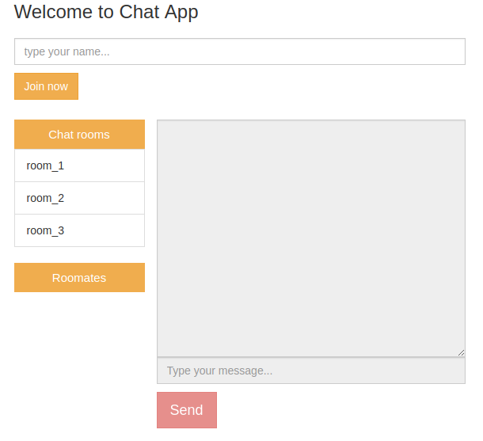

# Bài Tập Socket.IO cơ bản
### *Xây dựng ứng dụng chat đơn giản với NodeJS và Socket.io*

### Demo (terminal)
```javascript
git clone  https://github.com/DaveNguyenHuy/SocketBasic.git
npm install
npm start
```

## 1. Tạo server bằng NodeJS và kết nối với Socket.io (index.js)

```javascript
var app = require('http').createServer(handler);
var io = require("socket.io")(app);
var fs = require("fs");

//PORT = 3001
app.listen(3001);

// Create Server function handler
function handler (req, res) {
  fs.readFile(__dirname + '/index.html',
  function (err, data) {
    if (err) {
      res.writeHead(500);
      return res.end('Error loading index.html');
    }

    res.writeHead(200);
    res.end(data);
  });
}
```
## 2. Giao diện ứng dụng ( index.html )
### Chức năng
* Nhập tên (đăng ký) để được tham gia phòng chat ( room default )
* Có thể chọn chat theo room hoặc chat đến 1 cá nhân trong room (Roomates)
* Chuyển qua lại giữa các room, Log out nếu muốn kết thúc chat. 


## 3. Phương thức
#### *Client và Server giao tiếp với nhau bởi việc gửi và tiếp nhận event*
#### *Socket.io sử dụng hai phương thức chính để giao tiếp giữa server(index.js) và client (index.html)*

#### Phương thức emit đẩy sự kiện và dữ liệu
```javacript
socket.emit("event", dataObject);
```
### Phương thức on tiếp nhận sự kiện và xử lý dữ liệu
```javacript
socket.on("event", data => {
   ...
})
```
#### *Phương thức gửi event đến tất cả thành viên trong room, trừ sender*
```javacript
socket.broadcast.to(room_name).emit('event', data);
```
#### *Phương thức gửi event đến tất cả thành viên trong room, bao gồm cả sender*
```javacript
io.sockets.in(room_name).emit("event", data);
```
#### *mỗi user client sẽ tự xác định bằng một id riêng bằng việc gọi thuộc tính socket.id*

#### socket.broadcast cũng có thể dùng để gửi event đến 1 client ID cụ thể
```javacript
socket.broadcast.to(client_id).emit('event', data);
```


